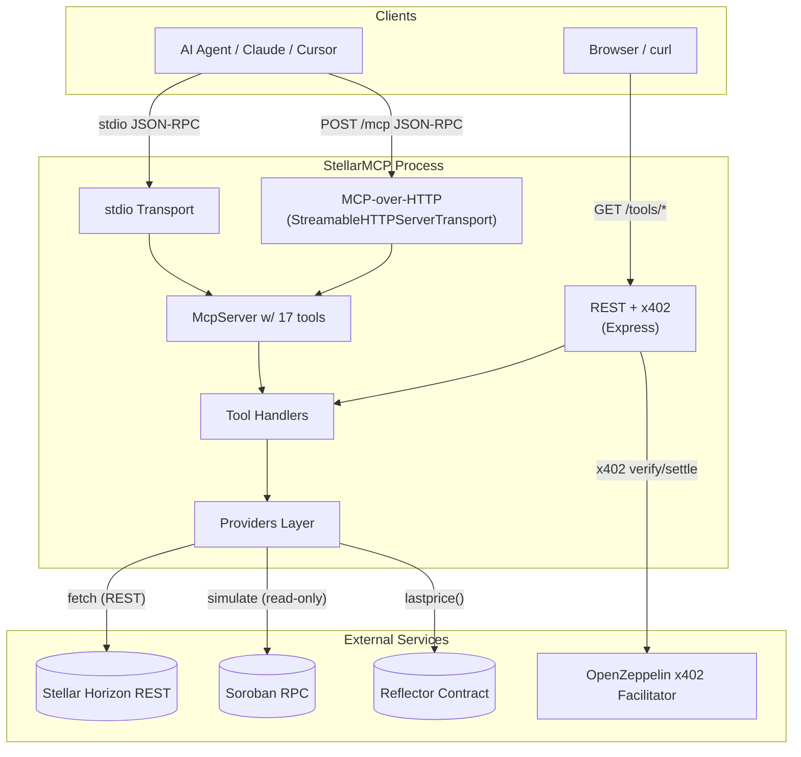
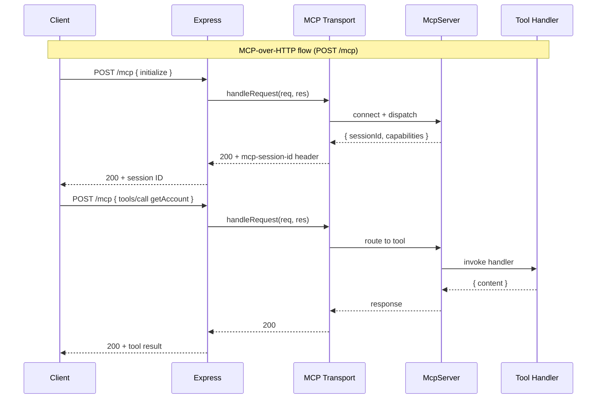
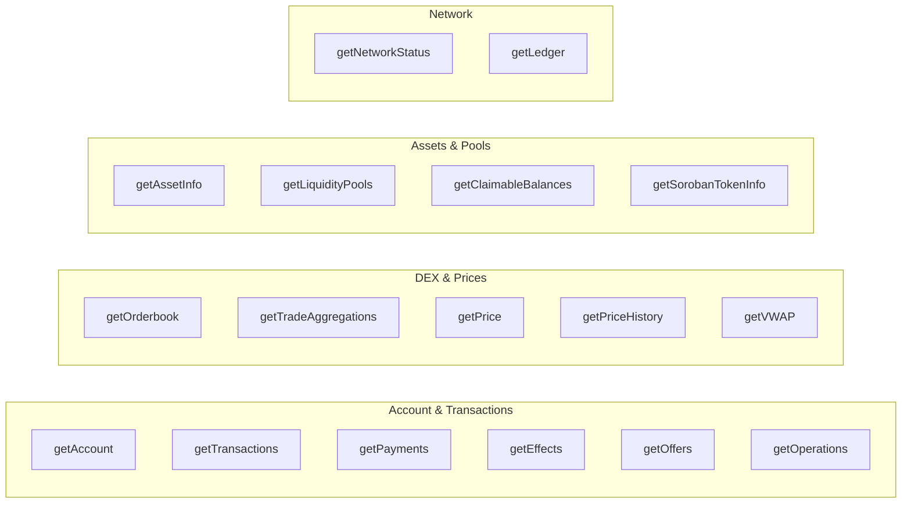
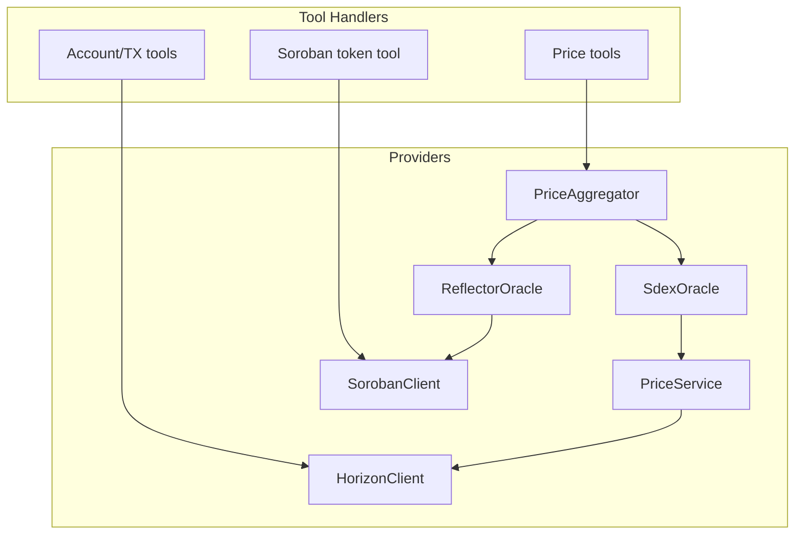
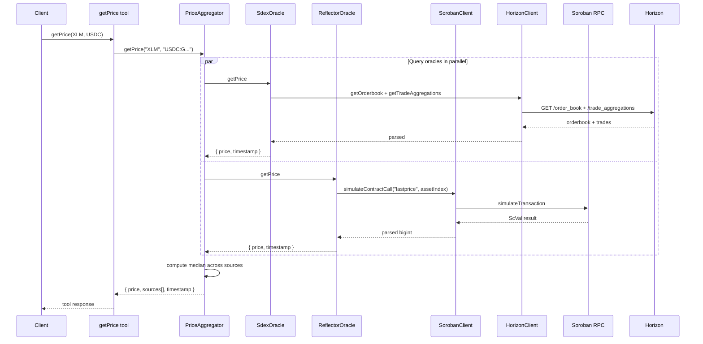
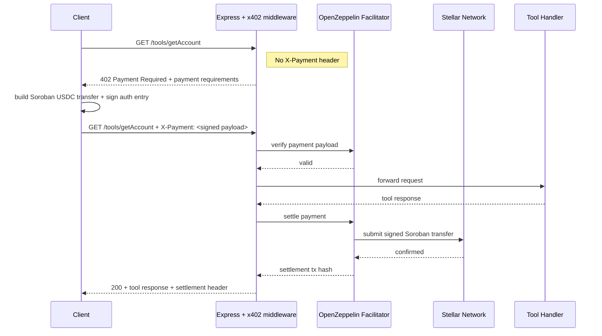
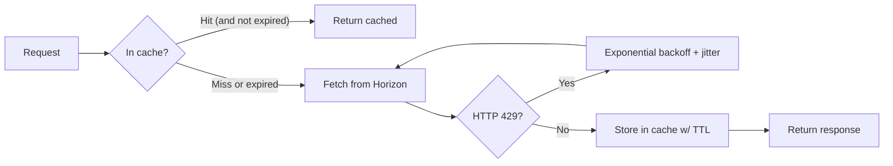
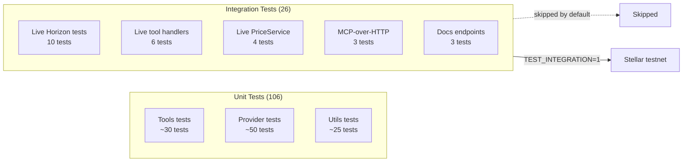

# StellarMCP Architecture

This document describes the internal architecture of StellarMCP — the layers,
data flow, and key design decisions. For deployment details see
[DEPLOYMENT.md](./DEPLOYMENT.md); for the API surface see
[`openapi.yaml`](../openapi.yaml) or the live `/docs` endpoint.

## Overview

StellarMCP is a Model Context Protocol (MCP) server that gives AI agents
read-only access to Stellar blockchain data, monetized via x402 micropayments
settled on Stellar itself. It runs as a single Node.js process serving 17 tools
over either stdio (local MCP clients) or HTTP (remote MCP clients + REST +
x402).

The process is deliberately stateless: no database, no durable queue, nothing
to migrate. All data is fetched on demand from Horizon (or Soroban RPC for
Reflector oracle queries) and cached in an in-memory LRU cache bounded to 1000
entries.

## High-level component map

## Layer breakdown

### 1. Transport layer

Three transports, all sharing the same `McpServer` instance with all 17 tools
registered:

- **stdio** (`src/index.ts`): The default. JSON-RPC over stdin/stdout for local
  MCP clients (Claude Desktop, Cursor, Claude Code).
- **HTTP REST** (`src/transports/http.ts`): One Express route per tool under
  `/tools/*`, with x402 payment middleware gating paid endpoints. The classic
  web API surface consumable by curl, browsers, or any HTTP client.
- **MCP-over-HTTP** (`src/transports/http.ts`): Mounted at `POST/GET/DELETE
  /mcp` via the MCP SDK's `StreamableHTTPServerTransport`. Uses stateful
  sessions via the `mcp-session-id` header. Same McpServer instance as stdio —
  all 17 tools accessible over remote MCP.

### 2. Tool layer

17 tools registered via `src/tools/index.ts`. Each tool is a thin wrapper
around a provider call that validates params with Zod and formats the Horizon
response into a stable output shape.

Tool registration follows a uniform pattern (see `src/tools/account.ts` as the
canonical example): each tool exports a `register*Tools(server, horizon,
config)` function that calls
`server.tool(name, description, zodSchema, handler)`. Handlers are wrapped in
try/catch and return structured `{ content, isError }` objects — raw Horizon
error messages are never surfaced to callers.

### 3. Providers layer

Five provider classes encapsulate all external service access. Tools never
touch `fetch` directly — they go through a provider.

**HorizonClient** (`src/providers/horizon.ts`): Raw `fetch` calls against the
Stellar Horizon REST API. Built-in retry with jitter on 429 responses
(exponential backoff up to 10s, max 3 retries), in-memory LRU cache (max 1000
entries) with per-endpoint TTLs, and parameter pollution defense (skips
non-string params that could arrive from duplicated query strings).

**PriceService** (`src/providers/price.ts`): Wraps HorizonClient to compute
current price (mid of best bid/ask, falling back to last trade close), OHLC
history, and VWAP from trade aggregations. This is the SDEX-specific price
logic.

**SorobanClient** (`src/providers/soroban.ts`): Wraps Soroban RPC for
read-only contract simulation. Uses `@stellar/stellar-sdk` via dynamic
`await import("@stellar/stellar-sdk")` (the SDK is an optional
peerDependency, NOT bundled in production). Provides `simulateContractCall`,
`encodeAddress`, `encodeU32` helpers.

**PriceAggregator** (`src/providers/aggregator.ts`): Takes an array of
`OracleProvider` instances, queries them in parallel via
`Promise.allSettled`, discards failures, and returns the median price plus
full source attribution (which oracle reported what price, when).

**Oracle implementations** (`src/providers/oracle.ts`):
- `SdexOracle`: Wraps PriceService for SDEX-derived prices. Always available.
- `ReflectorOracle`: Queries Reflector.network's on-chain price contract via
  SorobanClient. Only reports as available when `REFLECTOR_CONTRACT_ID` is
  configured. Handles Reflector's fixed-point price scaling (10^14) and
  supports a fixed set of common assets (XLM, USDC, BTC, ETH, AQUA, yXLM).

### 4. Multi-oracle price aggregation

The aggregator is fault-tolerant: a dead oracle never blocks a healthy one.
If every oracle fails, the caller gets a clear `No oracle data available`
error rather than a partial result.

### 5. x402 payment flow

Prices per tool are defined in `src/x402/pricing.ts`. Simple reads are
`$0.001`; DEX/price/Soroban reads are `$0.002`. The `FREE_ROUTES` set carves
out `/health`, `/tools/getNetworkStatus`, `/pricing`, `/skill.md`, `/mcp`,
`/docs`, and `/openapi.yaml` — everything a client needs to discover the
service is free.

### 6. Caching

In-memory LRU cache (`src/utils/cache.ts`) with bounded size (max 1000
entries) and TTL eviction. Uses `Map` insertion order for FIFO eviction when
full. Cache keys are full URL strings including query params, so different
query shapes stay isolated. The cache lives inside the HorizonClient module
(`src/providers/horizon.ts`) and is shared across all tool handlers.

Per-endpoint TTLs (from `CACHE_TTL` in `src/providers/horizon.ts`):

| Endpoint class              | TTL  | Rationale                              |
|-----------------------------|------|----------------------------------------|
| Account / transactions / payments / effects / offers / operations / trades | 15s  | Default — fresh enough for agent loops |
| Orderbook                   | 5s   | Changes rapidly                        |
| Network status (root)       | 10s  | Quick to refresh, lightweight          |
| Ledger                      | 30s  | Immutable once closed                  |
| Asset metadata              | 60s  | Changes rarely                         |

### 7. Configuration

The Zod schema in `src/config.ts` validates all environment variables at
startup. Network-derived defaults: when `STELLAR_NETWORK=pubnet` is set
without an explicit `HORIZON_URL`, the URL auto-derives to
`horizon.stellar.org` (and similarly for Soroban RPC). This prevents the
footgun where pubnet silently queries testnet.

Secrets (`STELLAR_SECRET_KEY`, `OZ_API_KEY`) are never parsed into the main
config tree — they're either read directly by scripts under `scripts/` or
loaded inside the HTTP server's x402 setup where they're needed.

### 8. Test architecture

132 tests total, split cleanly between fast unit tests that run on every
commit and slower integration tests that exercise real testnet endpoints.

Run unit tests with `pnpm test`. Run integration tests with
`pnpm test:integration`. Unit tests mock `fetch` and the SDK so they never
touch the network; integration tests make real calls against Stellar testnet.

## Key architectural decisions

### Decision: No @stellar/stellar-sdk in production bundle

Stellar's official SDK is 2MB+ with native dependencies. For Horizon REST
queries, raw `fetch()` is sufficient and keeps the bundle at ~30KB. The SDK
is required only for Soroban contract simulation (`SorobanClient`) and for
the wallet scripts (`scripts/keygen.ts`, `setup-usdc.ts`, the x402 client
scripts).

The SDK is declared as an **optional peerDependency** with `tsup external`
configuration so it stays out of the production bundle. `ReflectorOracle` and
`SorobanClient` use dynamic `await import("@stellar/stellar-sdk")` so the SDK
is only loaded at runtime if those providers are actually invoked — and only
when the user has installed it.

### Decision: Single McpServer instance, multiple transports

Rather than maintaining a separate `McpServer` per transport, StellarMCP
creates ONE `McpServer` in `src/index.ts`, registers all tools on it, then
either:

- connects it to a `StdioServerTransport` (stdio mode), or
- passes it into `createHttpServer(config, horizon, server)` which connects it
  to a `StreamableHTTPServerTransport` AND mounts the REST tool routes on the
  same Express app.

The same tool handlers serve all three transports. This avoids duplication
and guarantees feature parity between MCP and REST surfaces.

### Decision: PriceAggregator separate from PriceService

`PriceService` directly queries SDEX (the SDEX-specific price
implementation). `PriceAggregator` orchestrates multiple `OracleProvider`
instances. This split avoids a circular dependency
(`PriceService → SdexOracle → PriceService`) and lets the aggregator know
nothing about SDEX specifics. Adding a new oracle (Chainlink, Band, etc.) is
a matter of implementing `OracleProvider` and passing the instance into the
aggregator — no touching existing code.

### Decision: x402 middleware before route handlers, /mcp exempt

The x402 payment middleware is applied early in the Express middleware chain
so that REST tool routes are gated uniformly. The `/mcp` endpoint is added to
`FREE_ROUTES` and also bypassed by the per-tool rate limiter so that
MCP-over-HTTP traffic isn't double-gated by the same middleware that charges
the REST tools. Per-tool x402 gating over the MCP JSON-RPC body (inspecting
`tools/call` and charging based on the tool name) is a Phase 2 enhancement —
see the phase plan in [CLAUDE.md](../CLAUDE.md).

### Decision: Per-path rate limits

Free routes (60/min/IP) and paid routes (120/min/IP) get separate rate limit
buckets. `/mcp` is exempt entirely because MCP clients are stateful and
bursts are normal. This prevents an attacker from exhausting the rate limit
on free endpoints to starve paid endpoints (or vice versa).

### Decision: Stateless process, bounded in-memory cache

No database, no Redis, no disk state. The entire server is a pure function
of incoming requests plus a bounded cache. This makes horizontal scaling
trivial (spin up more containers behind a load balancer — each has its own
cache), makes crash recovery trivial (just restart), and eliminates an
entire class of data-loss bugs. Total RAM cost is capped at 1000 cache
entries regardless of load.

## File map

- `src/index.ts` — entry point, transport selection, `McpServer` construction
- `src/config.ts` — Zod env schema, mainnet defaults
- `src/types.ts` — Horizon response type definitions
- `src/utils/` — logger, cache, errors, formatters
- `src/providers/` — HorizonClient, PriceService, SorobanClient, oracle,
  aggregator
- `src/tools/` — 14 tool registration files (some register multiple tools)
  + `index.ts` barrel that wires them all into the McpServer
- `src/transports/http.ts` — Express server, MCP-over-HTTP mount, REST
  routes, x402 middleware
- `src/x402/pricing.ts` — `TOOL_PRICES` map + `FREE_ROUTES` set
- `tests/unit/` — 106 unit tests
- `tests/integration/` — 26 live testnet tests (opt-in via
  `TEST_INTEGRATION=1`)
- `examples/` — agent demo, mock external service, trading strategies
- `scripts/` — wallet keygen, USDC trustline setup, x402 client demos,
  stress test
- `openapi.yaml` — full OpenAPI 3.1 spec
- `Dockerfile` + `.dockerignore` — production container
- `docs/DEPLOYMENT.md` — production deployment guide
- `docs/MCP_REGISTRY.md` — MCP Registry submission guide
- `docs/X402_BAZAAR.md` — x402 Bazaar registration guide

## References

- README: [../README.md](../README.md)
- OpenAPI spec: [../openapi.yaml](../openapi.yaml)
- Deployment guide: [./DEPLOYMENT.md](./DEPLOYMENT.md)
- MCP Registry submission: [./MCP_REGISTRY.md](./MCP_REGISTRY.md)
- x402 Bazaar registration: [./X402_BAZAAR.md](./X402_BAZAAR.md)
- Source: https://github.com/siriuslattice/stellarmcp
- npm: https://www.npmjs.com/package/stellar-mcp-x402
